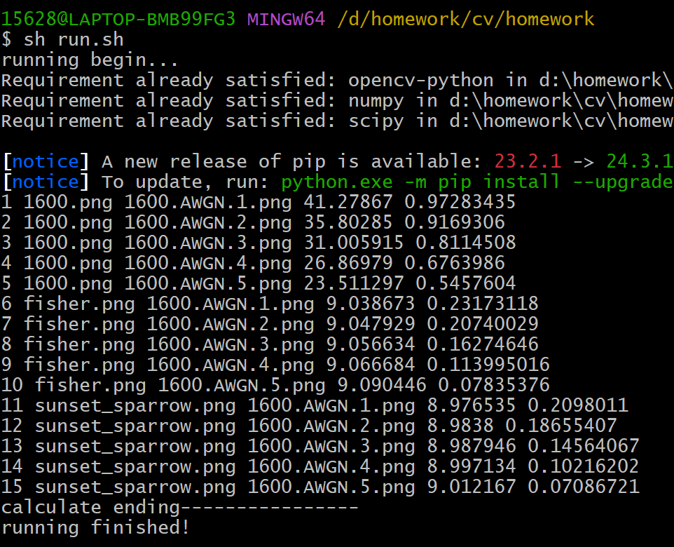

# 计算机视觉原理与算法作业

## 1、复现PSNR
先计算两幅图点对点的均方差，再带入公式求psnr即可。
```python
def PSNR(img1, img2, maxI=255):
    # img1为参考图像 img2为待评估图像
    mse = np.mean((img1 - img2)**2)
    psnr = 10 * np.log10(maxI*maxI/mse)
    return psnr
```
## 2、SSIM探索
### 2.1 为什么要基于滑动窗计算SSIM
- 通过分块处理图像，可以减少计算量并提高效率，可以并行处理不同的滑动窗口。
- 图像的全局相似性很大程度上取决于局部区域之间的相似性。
### 2.2 SSIM代码复现
- 参考源码使用高斯窗加权，默认`sigma=1.5, K1=0.01, k2=0.03`；
- 参考源码使用近似的方法计算方差和协方差；
- 默认`win_size=9`。
  
``` python
def SSIM(img1, img2, K1=0.01, K2=0.03, win_size=9, sigma=1.5, L=255):
    # img1为参考图像 img2为待评估图像
    C1 = (K1*L)**2
    C2 = (K2*L)**2
    # 高斯加权滑动窗口
    mu1 = gaussian_filter(img1, sigma)
    mu2 = gaussian_filter(img2, sigma)
    # 方差 和 协方差
    NP = win_size ** 2
    cov_norm = NP / (NP - 1)  # 样本方差
    sigma1 = (gaussian_filter(img1 * img1, sigma) - mu1*mu1) * cov_norm
    sigma2 = (gaussian_filter(img2 * img2, sigma) -mu2*mu2) * cov_norm
    sigma12 = (gaussian_filter(img1 * img2, sigma) - mu1*mu2) * cov_norm
    # ssim
    A1 = 2*mu1*mu2+C1
    A2 = 2*sigma12+C2
    B1 = mu1**2 + mu2**2 + C1
    B2 = sigma1 + sigma2 + C2
    ssim = (A1*A2)/(B1*B2)
    ssim = np.mean(ssim)
    return ssim
```

## 3、代码运行
切换到根目录下，直接运行脚本即可，会激活相应的虚拟环境并安装`requirements.txt`里对应的依赖库。
```
opencv-python
numpy
scipy
```
<br>
在命令行输入指令`sh run.sh`，可以得到score_test.csv文件，输出信息如下图，分别代表序号，参考图像，待评估图像，PSNR分数，SSIM分数。
<br>



